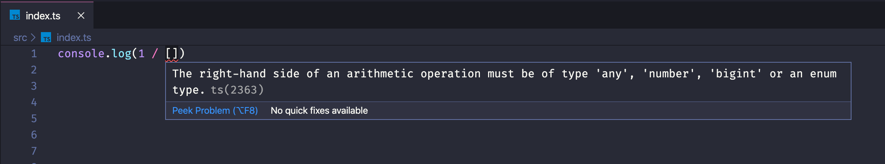

# Studies: TypeScript

> Compilado de estudos relacionados à TypeScript!

## Sumário

- [O que é TypeScript?](#o-que-é-typescript)
- [Porque usar TypeScript?](#porque-usar-typescript)
- [Desvantanges do TypeScript](#desvantanges-do-typescript)
- [Mitos](#mitos)
- [Referências](#referências)

## O que é TypeScript?

- É um superset do JavaScript;
- Adiciona novas features ao JavaScript;
- Novas features: tipagem estática!
- Compila para JavaScript.
- Permite adoção gradual (um projeto com arquivos `.ts`, convivem com arquivos `.js`).

## Porque usar TypeScript?

- Evita resultados inesperados

Como o JavaScript é dinâmico, podemos atribuir valores a variáveis de um tipo ou de outro. Por conta disso, também podemos ter resultados de um jeito, ou de outro:

```javascript
const sum = (a, b) => a + b

✅ sum(1, 2) // 3

❌ sum('1', '2') // 12 ops!
```

> No exemplo, a variável `a` pode receber valores de diferentes tipos (`1`, e `'1'`). Já com o **TypeScript**, esse tipo de erro não aconteceria, já que podemos definir o tipo da variável `a`, para `number`, por exemplo.

- Avisa se estiver fazendo algo errado

<p align="center">
  
</p>

> No exemplo, estamos recebendo um aviso de que, para a operação aritmética, o dado do lado direito deve ser do tipo `any`, `number`, `bigint` ou um enum type.

- Já funciona como uma espécie de documentação

```typescript
type Platform = "Windowns" | "Mac OS" | "Linux";

interface IGameDetails {
  id: string;
  title: string;
  description: string;
  platforms: Platform[];
}
```

A principal vantagem é que conseguimos saber em tempo de desenvolvimento, o que é cada propriedade.

- Deixa a IDE inteligente!

<p align="center">
  
</p>

Através do _IntelliSense_, a IDE é capaz de identificar quais métodos são atribuídos ao `prototype` de um determinado tipo de variável, e com isso, fornecer recursos como "conclusão de código" (ou _autocomplete_ de código), "assistente de conteúdo", e etc.

## Desvantanges do TypeScript

- Necessita ser compilado antes de ser usado em produção;
- Curva de aprendizado inicial (dos tipos e boas práticas);
- Erros nem sempre são muito claros ou então são muito grandes (difícil ter um _tracking_ mais assertivo do erro).

## Mitos

- "Vou ter que aprender tudo de novo".

  ❌ **MITO**: O **TypeScript** adiciona novos recursos ao **JavaScript**, então, se você já sabe JavaScript, basta aprender apenas a utilizar os recursos do TypeScript. <br/>

- "Vou precisar reescrever tudo para TypeScript".

  ❌ **MITO**: Você pode fazer uma adoção gradual para TypeScript nos seus projetos, trabalhando tanto com JavaScript quanto com TypeScript, no mesmo projeto.

- "Já escrevo testes, não preciso disso.".

  ❌ **MITO**: Você pode ter AINDA MAIS segurança ao escrever seus testes com TypeScript.

- "Só funciona com Programação Orientada à Objetos".

  ❌ **MITO**: O **TypeScript** funciona com qualquer paradigma.

- "É verboso demais, preciso tipar TUDO!".

  ❌ **MITO**: De fato, você escreve um pouco mais por conta da definição de tipos, mas não necessariamente, você precisar sair tipando tudo no projeto. Uma vez que temos a [inferência de tipos](https://www.typescriptlang.org/docs/handbook/type-inference.html), o TypeScript já identifica qual é o tipo de variáveis, dada as suas atribuições de valores.

- "Só serve para projetos grandes".

  ❌ **MITO**: Você pode utilizar em qualquer tipo de projeto. É claro, te dará muito mais escalabilidade no futuro, a medida em que seu projeto começa a tomar proporções maiores.

## Referências

- JUSTEN, Willian. **Mini-curso de TypeScript**. [S. l.], 2020. Disponível em: [https://www.youtube.com/playlist?list=PLlAbYrWSYTiPanrzauGa7vMuve7_vnXG_](https://www.youtube.com/playlist?list=PLlAbYrWSYTiPanrzauGa7vMuve7_vnXG_). Acesso em: 18 maio 2020.
